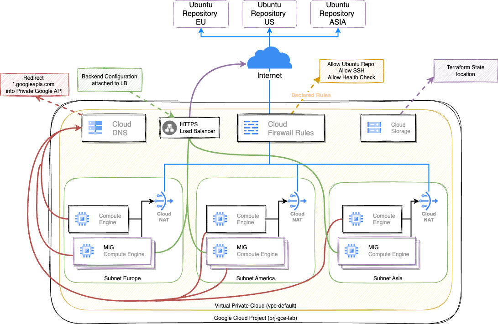

# A Guided Journey to Google Cloud 
This repository contains Terraform code to help people take their first steps on Google Cloud Platform (GCP) through a focused journey on Compute Engine, Security, and Networking. The code is organized into different folders for each stage of the deployment process.

## Overview 

>[!NOTE] Folder deployment
> - [**0-init**](0-init/readme.md): Initialization of the project, enabling APIs, creating service accounts, and managing bindings.
> - [**1-network-layer**](1-network-layer/readme.md): Setting up the network layer, including VPC creation, subnets across multiple regions with Private Access Mode, Cloud NAT, Cloud DNS for googleapis.com private APIs, and firewall rules for various services.
> - [**2-compute-deploy**](2-compute-deploy/readme.md): Deployment of Compute Engine instances on the created subnets with a startup script installing nginx.
> - [**3-mig-deploy**](3-mig-deploy/readme.md): Deployment of Managed Instance Groups (MIGs) attached to a Global External Load-Balancer.

## Components 

- Compute Engine: 
  - Provision and manage virtual machines (VMs) tailored for your application workloads.
- Networking: 
  - Establish a secure and well-defined network foundation using Virtual Private Cloud (VPC) and subnets for regional resource isolation
  - Cloud NAT for outbound internet access while maintaining security posture 
  - Cloud DNS for resolving private and public APIs
  - Granular firewall rules for controlled network traffic flow
- Security: 
  - Prioritize security by employing service accounts with appropriate IAM roles for Terraform operations
  - leveraging service account key bindings for secure authentication
  - Implementing network segmentation with VPCs and firewalls
  - Identity Aware Proxy configuration for SSH Compute Engine

# Modular Code Structure: 

For clarity and maintainability, the repository is meticulously organized into well-defined folders representing distinct deployment stages:

- `0-init`: Initializes the GCP project environment
  -  enables essential APIs for Terraform operations, 
  -  creates a service account with meticulously assigned IAM roles granting required permissions 
  -  defines service account key bindings for secure authentication.

- `1-network-layer`: Establishes a secure and robust network foundation, encompassing:
  - VPC creation for isolated and controlled routing of your cloud resources.
  - Creation of 3 regional subnets within the VPC using Private Access Mode, enabling secure communication between instances in subnets Google services without public internet exposure.
  - Cloud NAT configuration to provide outbound internet access to VMs in private subnets while maintaining security by not exposing them directly to the public internet.
  - A Cloud DNS zone for resolving private APIs hosted on googleapis.com within the VPC, facilitating efficient internal communication and minimizing reliance on public DNS.
  - Stringent firewall rules to control network traffic flow, typically : 
    - allowing ingress SSH access for management
    - access to the Ubuntu repository for package updates
    - outbound access to private APIs on googleapis.com
    - and health checks for continuous monitoring of VM health.

- `2-compute-deploy`: Deploys 3 pre-configured Compute Engine VMs across the 3 regional subnets : 
  - Each VM is deployed with a startup script that automates the installation of Nginx
  - VM provisioning
  - Configuration management 

- `3-mig-deploy`(Optional): 
  - Offers an optional module for deploying 3 Managed Instance Groups (MIGs) attached to a Global External Load Balancer.
  - MIGs provide a scalable approach to managing groups of homogeneous VMs.
  - The load balancer intelligently distributes incoming traffic across the healthy VMs in the MIGs
  - ensure high availability and resiliency for your application.

# Prerequisite

> [!IMPORTANT]  
> Highlights information that users should take into account, even when skimming.
> 
>An active Google Cloud account and project (https://developers.google.com/workspace/guides/create-project)
>
>Terraform installed locally (https://developer.hashicorp.com/terraform/tutorials/aws-get-started/install-cli)
>
>Google Cloud SDK installed and configured with your project set (https://cloud.google.com/sdk/docs/install)
>

# Accessing Resources
After successful deployment, you can access the deployed resources through the Google Cloud Console or via their respective endpoints.

## Contributing
Contributions are welcome! If you find any issues or improvements, feel free to open a pull request or an issue.

> Note : this doc is partially generated by AI ;) 